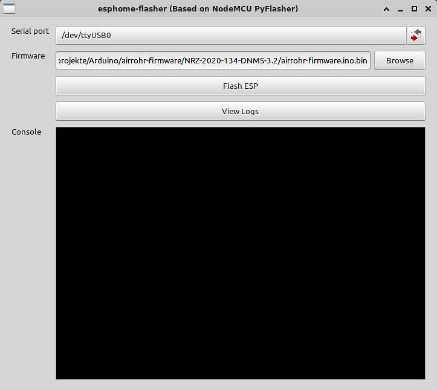
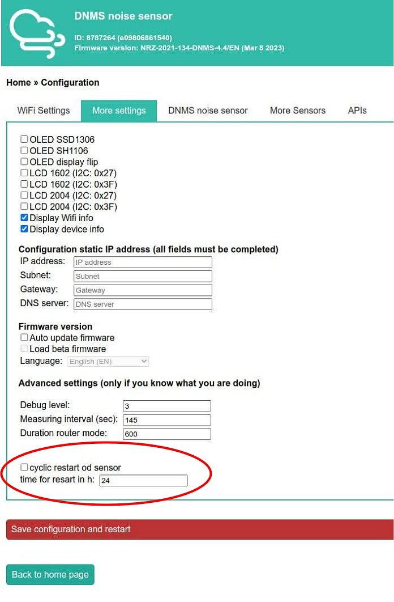

# find English text below

## NodeMCU Firmware für DNMS

## NRZ-2020-134-DNMS

### Versions Historie NRZ-2020-134-DNMS:

 - NRZ-2020-134-DNMS-4.4
   - Stabileres Verhalten des lokalen Webservers auf der NodeMCU durch Übersetzung mit der Version 3.1.1 der ESP8266 Library
   - Ein zyklischer Restart der NodeMCU kann unter Konfiguration -> Weitere Einstellungen angegeben werden mit einer Zeitangabe für den Restart in Stunden. Dies kann bei Problemen mit Routern und Proxys helfen, die nach einer festen Zeit die WLAN Verbindung unterbrechen.  
   - Unterstützung weiterer Sensoren: 
   -- SEN5X Feinstaub, Temperatur u. Feuchtigkeitssensor sowie je nach Version Index für VOC und NOx 
   -- SCD30 CO2 Sensor 
   -- SCD40 CO2 Sensor 
   
   - Erweitere Status Ausgabe von Sensoren (DNMS, SEN5X, SCD30, SCD40) unter Gerätestatus, insbesondere Ausgabe der DNMS Version:
   
   - 

 - NRZ-2020-134-DNMS-4.4-en
 	 - Version mit englischen Texten auf der lokalen Webseite, ansonsten identisch mit NRZ-2020-134-DNMS-4.4
  
 	 
 - NRZ-2020-134-DNMS-4.2
	 - 2.Messintervall unabhängig vom 1. Messintervall (ab 1 Sekunde)
	 - Wenn die Daten des 1. Messintervalls zu Sensor.Community übertragen werden (Sensor.Community unter APIs ausgewählt), denn wird die Zeit des 1. Messintervall auf 145 Sekunden gesetzt unabhängig davon, welche Zeit dort zuvor eingetragen wurde, damit die Übertragung zu Sensor.Community zustande kommt
	 - Ist unter APIs die Übertragung zu einer InfluxDB ausgewählt, werden sohl die Daten des 1. als auch die Daten des 2. Messintervalls zu der InfluxDB übertragen
	 - Bei der Übertragung zur InfluxDB wird ein in der NodeMCU generierter Zeitstempel mit zur InfluxDB übertragen. Zu Sensor.Community wird wie bei der standard Sensor.Community NodeMCU Firmware kein Zeitstempel übertragen
	 - Konfiguration neuer Reiter 'DNMS Lärm Sensor':
	 
	 -- aktiviere/deaktivieren der DNMS Berechnung Frequenzspektrum 
	-- aktivieren/deaktivieren des 2. Messintervalls für DNMS 
	-- Eingabe der Intervallzeit des 2. Messintervalls (ab 1 Sekunde) 
	-- Eingabe eines Schwellwertes in dB(A) für den LAeq des 2. Messintervalls ab dem die Übertragung der Werte des 2. Messintervalls gestartet wird 
	-- Eingabe der Anzahl an Messungen des 2. Messintervalls, die nach Überschreitung des Schwellwerts übertragen werden. Wird der Schwellwert während dieser Zeit überschritten, startet die Zählung der Messungen wieder bei 0. 
	-- aktivieren/deaktivieren ob ein GPIO Ausgang nach Überschreitung des Schwellwerts geschaltet werden soll. 
	-- Eingabe des GPIO Ausgangs, der bei Überschreitung des Schwellwerts geschaltet werden soll. Bitte prüfen, ob der Ausgang nicht anderweitig benutzt wird! 
	-- Eingabe eines DNMS Korrekturwertes (wie in den Versionen zuvor) 
	-- Eingabe der GPIO Pins für die I²C Verbindung zum DNMS sensor (und evtl. anderen Sensoren). Die standard GPIO Pins von Sensor.Community für die NodeMCU sind: GPIO Pin 2 für SCL und GPIO Pin 0 für SDA. Für ein Wemos Board kann die Belegung beispielsweise  geändert werden auf: GPIO Pin 5 für SCL und GPIO Pin 4 für SDA. Bitte Vorsicht bei der Änderung der I²C Pins.
	 
	 - Die weiteren Sensoren sind nun unter dem Reiter Konfiguration 'Weitere Sensoren' zu finden.
  

 - NRZ-2020-134-DNMS-4.2-en
 	 - Version mit englischen Texten auf der lokalen Webseite, ansonsten identisch mit NRZ-2020-134-DNMS-4.2
  

 - NRZ-2020-134-DNMS-3.3 - Korrektur der I²C Clock Frequenz
 
 - NRZ-2020-134-DNMS-3.3-en - Korrektur der I²C Clock Frequenz  

 - NRZ-2020-134-DNMS-3.2
	- Abfrage Terzwerte vom DNMS - Vorausetzung Firmware V3 oder V4 auf dem Teensy
	- Terzwerte werden **nicht** an Sensor.Community übertragen
	- Terzwerte können an andere APIs übertragen werden z.B. InfluxDB
	 
	
 - NRZ-2020-134-DNMS-3.2-en
	 - Version mit englischen Texten auf der lokalen Webseite, ansonsten identisch mit NRZ-2020-134-DNMS-3.2
  

## Firmware auf das NodeMCU Board schreiben (flashen)

Die übersetzten lauffähigen Programme haben immer die Bezeichnung airrohr-firmware.ino.bin. Sie müssen nur noch auf das NodeMCU Board geschrieben (geflasht) werden. 

### ohne Arduino IDE

Es ist nicht notwendig dafür die Arduino IDE zu installieren und/oder zu benutzen. Eine geeignete Anwendung dafür ist der kostenlose ESPHome-Flasher. Über den Link: https://github.com/esphome/esphome-flasher/releases kann die Anwendung für Windows, Mac und Linux (Ubuntu) geladen und dann installiert werden.  
Nach dem Starten des ESPHome-Flashers zuerst den seriellen Port auswählen (obere Zeile Serial port):

Dann die Firmware auswählen, die auf die NodeMCU geflasht werden soll (Zeile Firmware):

Mit dem Button "Flash ESP" das Flashen starten. Im Console Fenster erscheinen Ausgaben, die über den Verlauf des Vorgangs informieren.

Achtung: Da der ESPHome-Flasher den gesamten Flash Speicher löscht, gehen auch abgespeicherte Konfigurationsdaten verloren und die NodeMCU muss nach dem Flashen wieder in das lokale WLAN integriert werden. Evtl. wird beim Zugriff auf die NodeMCU, wenn die NodeMCU als AP arbeitet, ein Passwort abgefragt. Das Passwort lautet: "airrohrcfg". Ebenso sind die Konfigurationsdaten der Sensoren und der APIs gelöscht und müssen wieder eingeben werden! 

### mit Arduino IDE

Ist die Arduino IDE installiert, erfolgt das Schreiben der Firmware auf das NodeMCU Board direkt im Anschluss an die Übersetzung der Firmware aus der Arduino IDE heraus (siehe Arduino IDE Beschreibung).

## Anmerkung zum selbst Übersetzen der NodeMCU Firmware

 - Zum Übersetzen der Version 4.4 unbedingt die ESP8266 Library 3.1.1 benutzten.

 - Die Übersetzung der Firmware kann unter der Arduino IDE erfolgen. Alle Libs, die auch in der Sensor.Community firmware eingebunden werden, müssen auch hier verfügbar sein. Nur die für die Arduino IDE notwendigen Files sind im Source Ordner enthalten. PlatformIO wird nicht benutzt, deshalb sind keine PlatformIO Files vorhanden. In der Arduino IDE Umgebung ist ein File mit dem Namen platform.local.txt anzulegen mit den beiden folgenden Einträgen:

	compiler.c.extra_flags=-fpermissive 
	compiler.cpp.extra_flags=-fpermissive 
	

------------------------------------------------------------------------
# English text

## NodeMCU firmware for DNMS

## NRZ-2020-134-DNMS

### Version history NRZ-2020-134-DNMS:

  - NRZ-2020-134-DNMS-4.4
    - More stability of thge local NodeMCU webserver based on compilation with version 3.1.1 of ESP8266 Library
    - Cyclic restart can now be configured with timing in hours. This can solve problems with routers and proxys, which cut the WLAN connection after a specific time frame.  
    
    - Support of further sensors: 
   -- SEN5X PM, temperature, humidity and depending on the version VOC index and NOx index 
   -- SCD30 CO2 sensor 
   -- SCD40 CO2 sensor 
   
    - More status output for some sensors (DNMS, SEN5X, SCD30, SCD40) shown under device status, especially showing DNMS version:
    
    - 

 - NRZ-2020-134-DNMS-4.4-en
 	 - Version with english text on the local webpage, otherwise identical with  NRZ-2020-134-DNMS-4.4  

 
 - NRZ-2020-134-DNMS-4.2
	 - 2nd measurement interval independent from 1st interval (from 1 second on)
	 - If transmission of data from the 1st interval to Sensor.Commiúnity is activated, then the measurement time for the 1st interval is set to 145 seconds independently what time was configured before to make the transmission to Sensor.Community possible
	 - Is the transmission to an InfluxDB is activated, then 1st interval data as well as 2nd interval data is transmitted to the InfluxDB
	 - A timestamp is added in the NodeMCU to the data transmitted to an InfluxDB. No timestamp is added to the data to Sensor.Community, no change compared to the standard Sensor.Community NodeMCU firmware
	 - Home  >> Configuration new tab "DNMS noise sensor":
	 
	 -- activate/deactive DNMS frequency spectrum 
	-- activate/deactivate DNMS 2nd measurement interval 
	-- configure the interval time for the 2nd measurement (from 1 second on) 
	-- configure a threshold in dB(A) for the LAeq value that transmission of 2nd measurement values is started 
	-- configure the number of 2nd interval measurements that are transmitted after the threshold is exceeded. If the threshold is exceeded during that time, the number starts counting again 
	-- activate/deactivate switching of an GPIO output port if the threshold is exceeded 
	-- configure the GPIO port that is switched - be careful and check that the pprt is not otherwise used 
	-- configure a DNMS correction (as in versions before) 
	-- configuration of GPIO pins for the I²C connection to the DNMS sensor (and maybe other sonsors). The standard from Sensor.Community for the NodeMCU is: GPIO pin 2 for SCL and GPIO pin 0 for SDA. For a Wemos board you can change it e.g. to GPIO pin 5 for SCL and GPIO pin 4 for SDA. Please be careful changing the I²C pins.
	
	 - Futher sensors are now under the tab "more sensors"

 - NRZ-2020-134-DNMS-4.2-en
 	 - Version with english text on the local webpage, otherwise identical with  NRZ-2020-134-DNMS-4.2  
 	 

 - NRZ-2020-134-DNMS-3.3 - correction of I²C clock frequency
 
 - NRZ-2020-134-DNMS-3.3-en - correction of I²C clock frequency  
 
 - NRZ-2020-134-DNMS-3.2
	- Reading of 1/3 octave values from DNMS - prerequisite using firmware V3 or V4 on Teensy
	- 1/3 octave values are **not** transmitted to Sensor.Community
	- 1/3 octave values can be transmistted to other APIs e.g. to an InfluxDB
	
 - NRZ-2020-134-DNMS-3.2-en
	 - Version with english text on the local webpage, otherwise identical with  NRZ-2020-134-DNMS-3.2
  

## How to flash the NodeMCU
The compiled and executable firmware for the NodeMCU is always named airrohr-firmware.ino.bin. The firmware has only to be flashed on the board.

### without Arduino IDE

There is no need to install and use the Arduino IDE to flash the NodeMCU. A standalone application for doing that job is ESPHome-Flasher. You can download the appropriate version for Windows, Mac and Linux (Ubuntu) application via the link: https://github.com/esphome/esphome-flasher/releases,and then install the application.
  
After start of the application ESPHome-Flasher first select the serial port where the NodeMCU is connected to (top line):

Then select the firmware you want to flash (line Firmware):

Start the flashing process by clicking the button "Flag ESP". in the Console window some output is schown about the progress of the flashing process.

Attention: ESPHome-Flasher erases the complete flash therefore all configuration data is lost as well. The NodeMCU has to be integrated in your local WLAN. Possibly a password will be asked by accessing the NodeMCU. The password is "airrohrcfg". As well all sensor configuration and API configuration is lost and has to be input again!

### with Arduino IDE

Is the Arduino IDE installed then flashing of the NodeMCU takes place as the next step after compiling the firmware as part of the Arduino IDE. Please have a look at the Arduino IDE documentation.

## Note how to compile the NodeMCU firmware yourself

- To compile version 4.4 yourself using ESP8266 Library 3.1.1 is necessary.

- Compilation can be done using the Arduino IDE. All libs, which are used by the Sensor.Community firmware have to be installed as well. Only the files 
which are relevant for the Arduino IDE are within the source folder. PlatformIO is not used and there are no PlatformIO files in the source folder. For the Arduino IDE a file with the name platform.local.txt has to be generated and placed at the right position with the following content:

	compiler.c.extra_flags=-fpermissive
	compiler.cpp.extra_flags=-fpermissive
	
