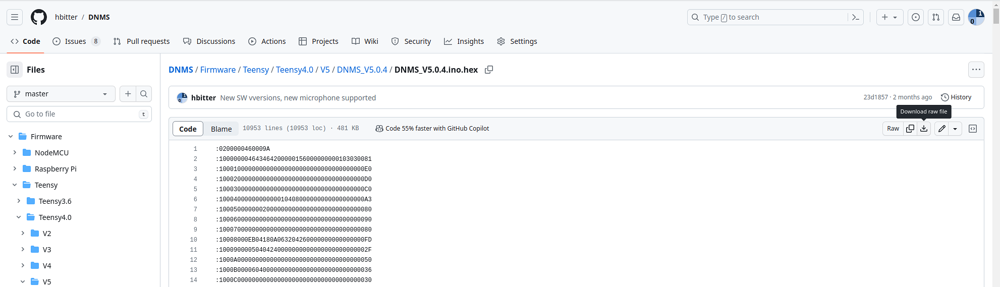

# [English text below](#english text)

## Anmerkung zum Download einzelner Files

Auch um einen einzelnen File (z.B. DNMS_V1.1.0.ino.hex) herrunterzuladen ist es am einfachsten das gesamte Repository als ZIP herunterladen, zu entpacken und den benötigten File zu kopieren.

 

Eine weitere Möglichkeit ist den File in GitHub zu öffnen und dann die Funktion Download raw file zu benutzen.

 

------------------------------------------------------------------------

# Englisch text

## Note how to download single file

Even if you want to download only a single file (e.g. DNMS_V1.1.0.ini.hex), the easiest way is to download the complete repository as a ZIP, unpack it and copy the required file.

 

Another way is to open the file in GitHub and use the function Download raw file.

 

