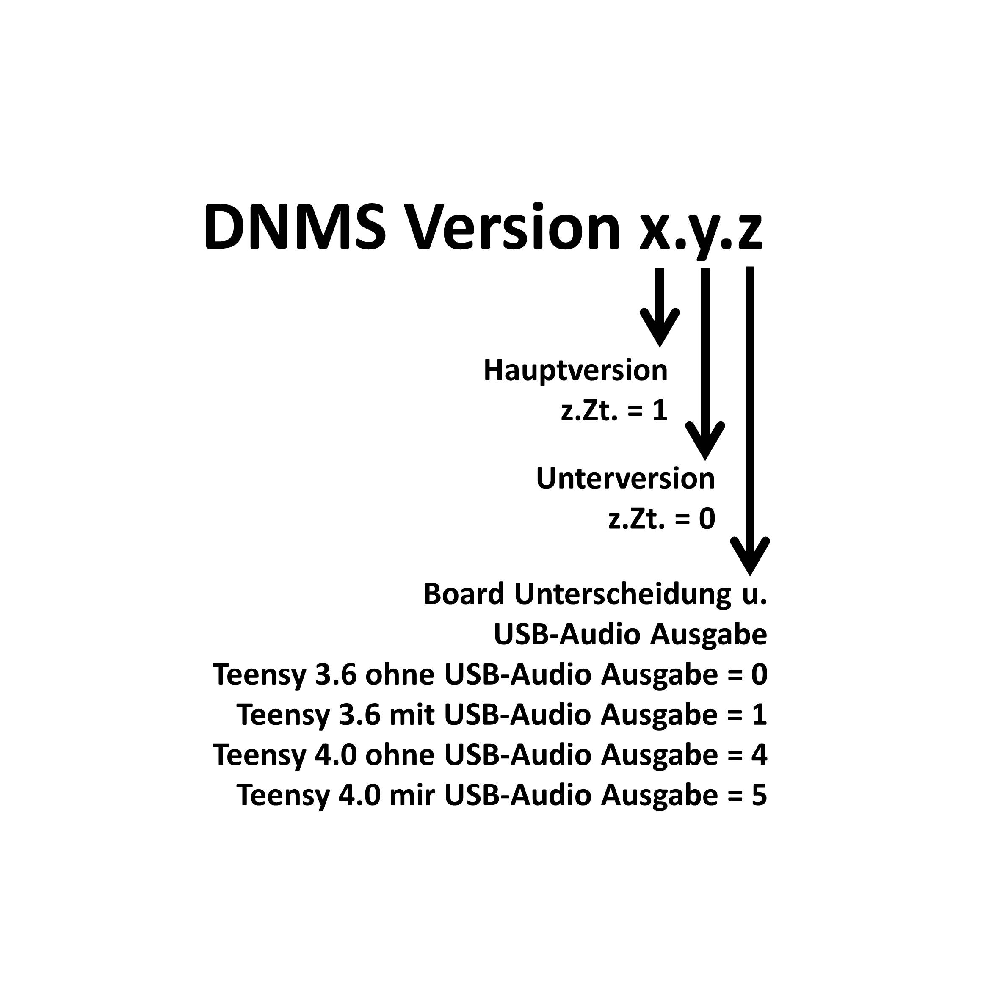

# DNMS Firmware for Teensy 3.6 and Teensy 4.0

## Die Software/Firmware für Teensy 4.0 ist in Erprobung und noch nicht freigegeben

## aktuelle Firmware für Teensy 3.6 ist V1.1.0 und V1.1.1

## Version Historie Teensy 3.6

###  - V1.0.0 und V1.0.1 - erste Versionen

###  - V1.1.0 und V1.1.1 - Änderung I²C Bibliothek, es wird nun die i2c_t3 Bibliothek eingesetzt https://github.com/nox771/i2c_t3, die in der Kommunikation stabiler ist 

## Bezeichnung der Versionen

 

------------------------------------------------------------------------

## software/firmware for Teensy 4.0 is still beeing tested and not yet released

## current firmware for Teensy 3.6 is V1.1.0 and V1.1.1 

## version history Teensy 3.6

###  - V1.0.0 und V1.0.1 - initial versions

###  - V1.1.0 und V1.1.1 - change of I²C library, now it is: i2c_t3  https://github.com/nox771/i2c_t3, which is more stable 

## naming convention for the different versions

 

