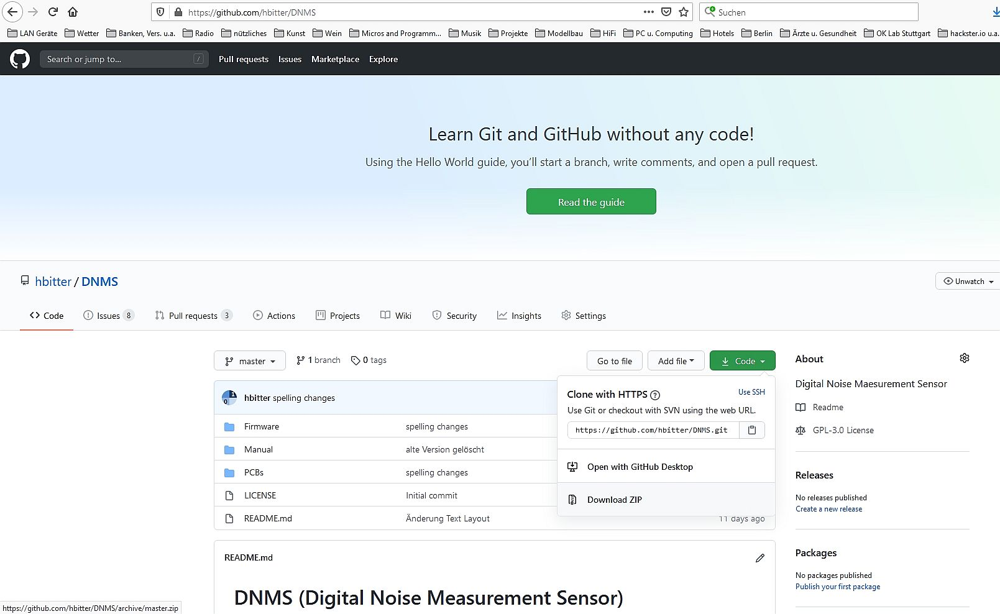

# find English text below

## Anmerkung zum Download einzelner Files

Auch um einen einzelnen File (z.B. DNMS_V1.1.0.ino.hex) herrunterzuladen ist es am einfachsten das gesamte Repository als ZIP herunterladen, zu entpacken und den benötigten File zu kopieren.

 

------------------------------------------------------------------------

# Englisch Text

## Note how to download single file

Even if you want to download only a single file (e.g. DNMS_V1.1.0.ini.hex), the easiest way is to download the complete repository as a ZIP, unpack it and copy the required file.

 

