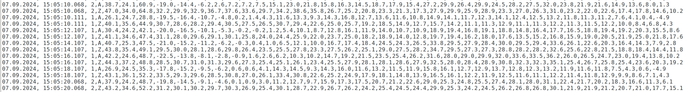
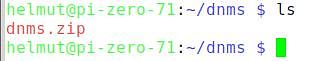
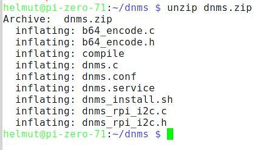
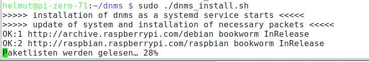
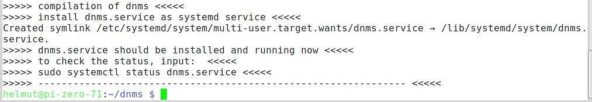
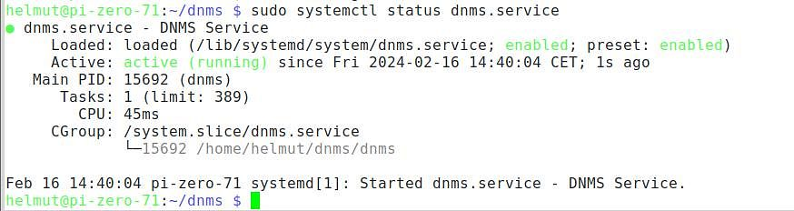
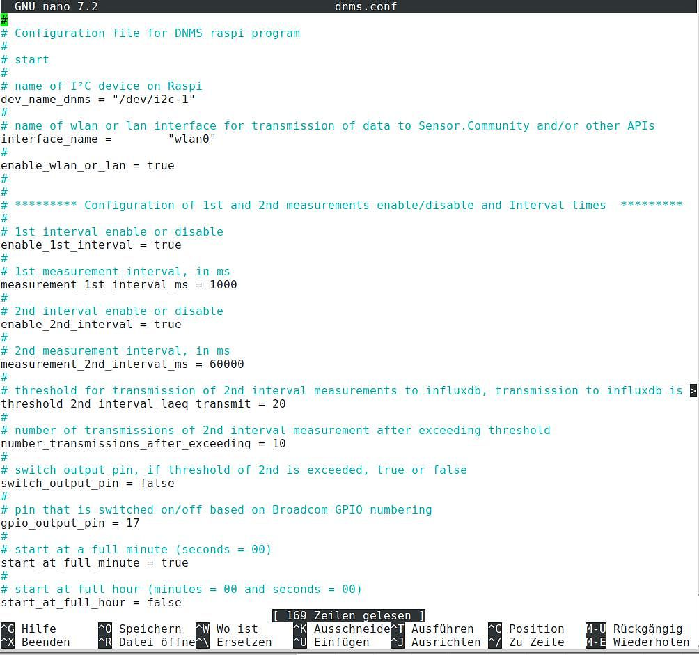
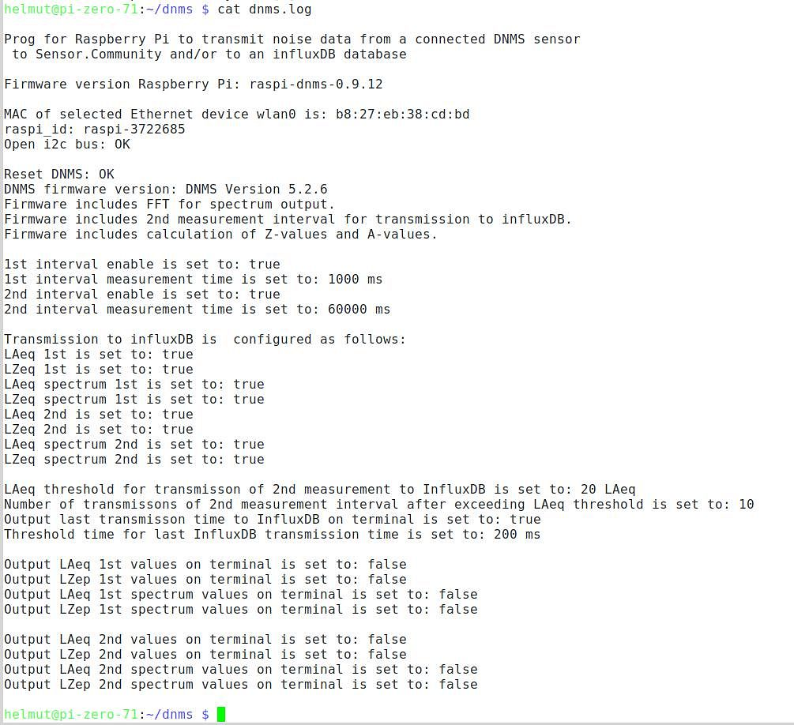
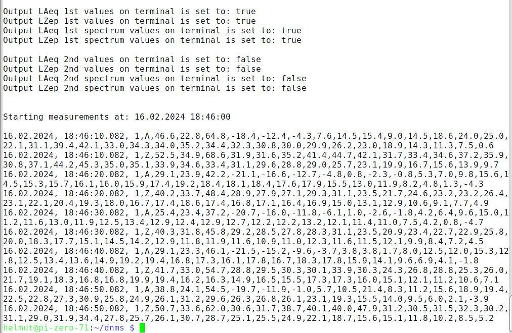

# [English text below](#raspberry-pi-application-for-dnms)

## Raspberry Pi Anwendung für DNMS

Ab Pi Zero W möglich, Pi Zero 2 W und aufwärts empfohlen.

### Versions Historie:

 - dnms-0.9.21 ersetzt Version dnms-0.9.20 aufgrund von Fehlern.
 	+ Fehler in der dnms.conf beim Eintrag 'mqtt_transmit'.
 	+ Fehlerhaft gesetzte Prioritäten für die Threads in der dnms.conf ('prio_1st_timer', ... usw).
 	+ Neben der InfluxDB HTTP Übertragung kann nun parallel eine Übertragung der Werte zu einem MQTT Broker erfolgen.

- dnms-0.9.20:

  - Start und Stopp der Messwertausgabe durch ein Steuersignal über eine named pipe. Das Beispiel-Programm, pipe_write, in C  ist beigefügt. Ebenso kann die Steuerung über die Konsole erfolgen, dazu z.B. zwei Variable definieren:

	```
	null="0"
	
	eins="1"
	```


    und zum Starten der Messwertausgabe:

    
	```
	echo $eins > /tmp/start_stop_dnms
	```
	

    und zum Stoppen:

    
	```
	echo $null > /tmp/start_stop_dnms
	```


    Der Name der named pipe kann in der Konfigurationsdatei frei gewählt werden, aber der Pfad ist festgelegt und muss im  Ordner /tmp liegen.

  - Data Logging der Messwertdaten auf der SD-Karte. Für jeden Tag wird eine Datei mit dem Dateinamen 'data_dd.mm.yyyy.csv' erzeugt.  Die Messwertdaten werden beim Data Logging, bei der Ausgabe auf dem Terminal und bei der Übertragung zu einer named pipe im ASCII Format jeweils mit einem Komma getrennt ausgegeben wie im folgenden Beispiel.

	

    Die Konfiguration welche Messwerte (1. Messintervall, 2. Messintervall, A-Werte, Z-Werte und die jeweiligen Terzwerte) übertragen werden, erfolgt in der Konfigurationsdatei dnms.conf für die Ausgabe auf dem Terminal, die named pipe Übertragung und das Data Logging gemeinsam.  

  - Änderung der Eingabe von Bool-Werten in der Konfigurationsdatei dnms.conf: Für false eine '0' und für true eine '1' eingeben. 

 - dnms-0.9.18:
	 - Korrektur eines Fehlers: Wenn nur die Ausgabe auf dem Terminal konfiguriert war, wurden die Werte nicht richtig auf dem Terminal ausgegeben.
	 - Neue Möglichkeit der Weitergabe von Messwerten mittels einer named pipe (oder auch fifo) zu anderen Anwendungen auf dem Raspberry Pi. Der Name der named pipe und der Ort können im Konfigurationsfile (dnms.conf) konfiguriert werden. Weiterhin, ob die Messwerte des 1. Messintervalls, des 2. Messintervalls oder beide mittel der named pipe übertragen werden. Ob die Konfiguration einer named pipe funktioniert kann einfach mit dem Befehl: cat "name der named pipe" überprüft werden. Die Ausgabe im Terminal entspricht dann der direkten Ausgabe auf einem terminal, wenn dies konfiguriert ist bzw. der Ausgabe der Messwerte im File dnms.log. Ein C-Beispielprogramm ist im Ordner "read_named_pipe" unterhalb dnms-0.9.18 beigefügt. Ein Beispiel wie von Python eine named pipe gelesen werden kann ist z.B. bei stackoverflow Frage: Python read named PIPE zu finden: https://stackoverflow.com/questions/39089776/python-read-named-pipe

 - dnms-0.9.16:
	 - MQTT Übertragung (z.Zt. kein TLS). Konfiguration im dnms.conf File. Die Daten werden im InfluxDB Line Protocol Format übertragen (wie bei der direkten InfluxDB Übertragung).
	 - Auswahl des am Teensy4.0 angeschlossenen Mikrofons durch einen Eintrag im dnms.conf File. Damit die Konfiguration durch einen entsprechenden Umschaltbefehl im Teensy4.0 umgesetzt werden kann, ist die Teensy4.0 Version DNMS_V5.3.x Vorraussetzung.
	 - Angabe eines Korrekturwertes für die DNMS Einzahlwerte im dnms.conf File.

 - dnms-0.9.12 erste veröffentliche Version der DNMS Kommunikations Anwendung für den Raspberry Pi.


###  Funktionalität:
  -	Übertragung der DNMS Daten zu Sensor.Community.
  -	Übertragung der DNMS Daten zu einer InfluxDB (V1.8) für unabhängige 2 Messintervalle.
  -	Das zweite Messintervall übertragt die Daten an die InfluxDB ab einem konfigurierbaren Schwellenwert (LAeq). Die Anzahl der Übertragungen (Messintervalle), die nach Überschreitung des Schwellenwertes übertragen werden, kann ebenfalls  konfiguriert werden.
  -	Konfiguration der Werte, die zur InfluxDB übertragen werden, wie LAeq, LZeq und/oder die jeweiligen Terzwerte.
  -	Minimales Messintervall von 125ms konfigurierbar. Sollen Terzwerte übertragen werden, ist dies ab einem Messintervall von 500ms aufwärts möglich.
  -	Konfiguration der Eigenschaften und der Übertragung der Messwerte an Sensor.Community und/oder einer InfluxDB mittels Konfigurationsdatei (dnms.conf).
  - Installation der Anwendung als Service d.h. die DNMS Anwendung läuft im Hintergrund und startet nach einem Neustart des Raspberry Pi automatisch.

### Voraussetzungen:
- Aktuelles Raspberry Pi OS installiert (Bookworm)
- ssh Zugriff auf den Raspberry Pi
- I²C Interface aktiviert (raspi-config) 
- ntp und ntpdate sollten installiert sein und Zeitabgleich durchgeführt sein z.B. mittels der folgenden Befehle:  
  
        sudo apt-get install ntp ntpdate -y
        sudo systemctl stop ntp
        sudo ntpdate de.pool.ntp.org
        sudo systemctl start ntp
	

### Installation:
 - ssh Verbindung zum Raspberry Pi herstellen.
 - Einen neuen Ordner für die Anwendung unterhalb des aktuellen Benutzers einrichten (z.B. dnms): 
  
        mkdir dnms
 - In den angelegten Ordner wechseln:
  
        cd dnms
 - Die .zip Datei (aktuell dnms-0.9.12.zip) vom PC auf den Raspberry Pi in den neu angelegten Ordner übertragen. Dafür eignet sich z.B. das kostenlose Programm FileZilla sehr gut (Win, Linux, Mac).
 - Überprüfen, ob die .zip Datei (aktuell dnms-0.9.12.zip) nun auf dem Raspberry Pi vorhanden ist mit ls:

	 

 - Entpacken der .zip Datei

		unzip dnms.zip

	mit folgendem Ergebnis:
	
	

- Die Datei dnms_install.sh ausführbar machen:
       
  
       chmod +x dnms_install.sh
- Das Installations-Script starten:
       
       sudo ./dnms_install.sh
	Das Installations-Script kann einige Minuten benötigen, bis es komplett durchgelaufen ist, da auch ein kompletter update/upgrade Zyklus durchlaufen wird.
	
	

  Das Installations-Script sollte folgendermaßen enden:
  
	

 - Überprüfung des Status von dnms.service:

       sudo systemctl status dnms.service

	

- Stoppen von dnms.service um zuerst die Konfiguration zu bearbeiten:

		sudo systemctl stop dnms.service

- Editieren der Datei dnms.conf, die die Konfiguration enthält z.B. mit nano:

		nano dnms.conf

	

- Sind alle Einstellungen angepasst in der Datei dnms.conf insbesondere Adresse, Passwort, Datenbankname usw. für den Zugang zu einer InfluxDB, kann dnms.service wieder gestartet werden:

		sudo systemctl restart dnms.service

- Achtung: Nach jeder Änderung der Konfiguration in der Datei dnms.conf, muss dnms.service wieder mit dem obigen Befehl gestartet werden.
- Konnte die Konfiguration erfolgreich gestartet werden, so wird ein Logfile mit dem Namen dnms.log im Installationsordner angelegt, Ausgabe z.B. mit:

	  cat dnms.log

	

- Die Messwerte können auch in die Datei dnms.log geschrieben werden. Dies muss konfiguriert werden (Output to Terminal - Umleitung der Terminalausgabe in die Datei). Es ist aber keine komplette Datenlogger Funktionalität realisiert. Diese rudimentäre Funktionalität dient zur Einrichtung und zum Test der Konfiguration und zur Aufzeichnung von Fehlern. Es lassen sich auch die Übertragungszeiten zur InfluxDB loggen. 

	


------------------------------------------------------------------------

## Raspberry Pi application for DNMS


Possible from Pi Zero W, Pi Zero 2 W and above recommended.

### Version history:

  - dnms-0.9.21 replaces version dnms-0.9.20 due to bugs.
 	+ Error in dnms.conf with entry 'mqtt_transmit'.
 	+ Incorrectly set priorities for the threads in dnms.conf ('prio_1st_timer', ... etc).
 	+ In addition to the InfluxDB HTTP transfer, the values ​​can now be transferred to an MQTT broker in parallel.

- dnms-0.9.20:

	 - Start and stop the output of measurements by a control signal via a named pipe. An example program in C, pipe_write, is included. The control can also be done from the console, e.g. by defining two variables:

		```
		null="0"
		
		eins="1"
		```


	   and to start the output of the measured values:

    
		```
		echo $eins > /tmp/start_stop_dnms
		```
	

	    and to stop the output of the measured values:

    
		```
		echo $null > /tmp/start_stop_dnms
		```


	   The name of the named pipe can be freely chosen in the configuration file, but the path is fixed and must be in the /tmp folder.

  - Data logging of the measurement data on the SD card. For each day a file with the name 'data_dd.mm.yyyy.csv' is created. The measurement data is output in ASCII format, separated by commas, during data logging, when output to the terminal and when transferred to a named pipe, as in the following example.

	

    The configuration of which measurement values (1st measurement interval, 2nd measurement interval, A-values, Z-values and the respective third octave values) are transmitted is made together in the configuration file 'dnms.conf' for output on the terminal, for named pipe transmission and data logging.

  - Changed the entry for bool values in the dnms.conf configuration file: Enter '0' for false and '1' for true.
	 
- dnms-0.9.18:
	 - Bug fix: If only output to terminal was configured, the values were not output correctly to the terminal.
	 - New way to pass measurements to other applications on the Raspberry Pi using a named pipe (or fifo). The name of the named pipe and the location can be configured in the configuration file (dnms.conf). You can also specify whether the named pipe should send the readings from the 1st interval, the 2nd interval or both. You can easily check if the configuration of a named pipe works with the command: cat "name of the named pipe". The output in the terminal then corresponds to the direct output on a terminal, if this is configured, or to the output of the readings in the file dnms.log. An example C program is included in the folder "read_named_pipe" below dnms-0.9.18. An example of how to read a named pipe from Python can be found in the stackoverflow question: Python read named PIPE: https://stackoverflow.com/questions/39089776/python-read-named-pipe

 - dnms-0.9.16:
	 - MQTT transmission (currently no TLS). Configuration in the dnms.conf file. The data is transmitted in InfluxDB Line Protocol format (as with direct InfluxDB transmission).
	 - Selection of the microphone connected to the Teensy4.0 through an entry in the dnms.conf file. On Teensy4.0 the version DNMS_V5.3.x is required to use the microphone switch command.
	 - Specify a correction value for the DNMS single values (does not apply to 1/3 octave values) in the dnms.conf file.
	
 - dnms-0.9.12 first released version of the DNMS communication application for the Raspberry Pi.

###  Functionality:
  -	Transfer of DNMS data to Sensor.Community.
  -	Transfer of DNMS data to an InfluxDB (V1.8) for 2 independent measurement intervals.
  -	The second measurement interval transmits data to the InfluxDB when a configurable threshold (LAeq) is exceeded. The number of transmissions (measurement intervals) to be sent when the threshold is exceeded can also be configured.
    -Configuration of the values to be transferred to InfluxDB, such as LAeq, LZeq and/or their respective 1/3-octave values.
  -	Minimum measuring interval configurable from 125ms. If 1/3-octave values are to be transmitted, this is possible from a measuring interval of 500ms upwards.
    -Configuration of properties and transmission of readings to Sensor.Community and/or an InfluxDB using a configuration file (dnms.conf).
  - Installation of the application as a service, i.e. the DNMS application runs in the background and starts automatically when the Raspberry Pi is rebooted.

### Prerequisite:
- Current Raspberry Pi OS installed (Bookworm)
- ssh access to the Raspberry Pi
- I²C interface enabled (raspi-config)
- ntp and ntpdate should be installed, which can be done using the following commands:  
  
        sudo apt-get install ntp ntpdate -y
        sudo systemctl stop ntp
        sudo ntpdate de.pool.ntp.org
        sudo systemctl start ntp
	
	Instead of using de.pool.ntp.org, use the appropriate pool for your country.
	
### Installation:
- Make an ssh connection to the Raspberry Pi.
 - Create a new folder for the application under the current user (e.g. dnms):
  
        mkdir dnms
- Switch to the created folder:
  
        cd dnms
- Copy the .zip file (currently dnms-0.9.12.zip) from your PC to the newly created folder on the Raspberry Pi. You can use the free program FileZilla (Win, Linux, Mac) to do this.
 - Use ls to check if the .zip file (currently dnms-0.9.12.zip) is now present on the Raspberry Pi:

	 

- Unzip the .zip file

		unzip dnms.zip

	with the following result:
	
	

- Make the dnms_install.sh file executable:
       
  
       chmod +x dnms_install.sh
- Launch the installation script:
       
       sudo ./dnms_install.sh

	The installation script may take a few minutes to complete as it will also perform a full update/upgrade cycle.
	
	

	The installation script should end as follows:  

	

- Check the status of dnms.service:

       sudo systemctl status dnms.service

	

- Stop the dnms.service to edit the configuration first:

		sudo systemctl stop dnms.service

- Edit the dnms.conf file that contains the configuration, e.g. with nano:

		nano dnms.conf

	

- Once all the settings in the dnms.conf file have been adjusted, in particular the address, password, database name, etc. for accessing an InfluxDB, the dnms.service can be restarted:

		sudo systemctl restart dnms.service

- Attention: After each change of the configuration in the dnms.conf file, the dnms.service must be restarted with the above command.
- If the configuration was started successfully, a log file with the name dnms.log is created in the installation folder:

		cat dnms.log

	

- The readings can also be written to the dnms.log file. This must be configured (output to terminal - redirect terminal output to the file). However, no complete data logger functionality is implemented. This rudimentary functionality is used to set up and test the configuration and to record errors. It is also possible to log the transfer times to InfluxDB.

	