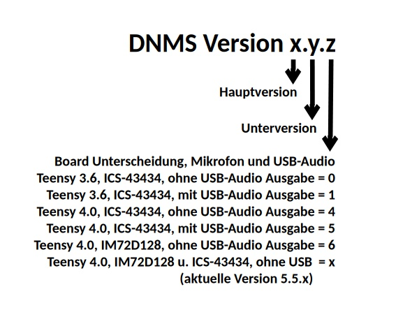

# [English text below](#dnms-firmware-for-teensy36-and-teensy40)

## DNMS Firmware für Teensy3.6 und Teensy4.0

## Teensy4.0

### Versions Historie Teensy4.0:

 - DNMS_V1.0.4 und DNMS_V1.0.5 - erste Versionen

 - DNMS_V2.0.4 und DNMS_V2.0.5 - Version 2 der Firmware basierend auf 32-Bit Floating Point Verarbeitung

- aktuelle V2 Versionen:
	- DNMS_V2.2.4 und DNMS_V2.2.5 - Änderung der Zeitgewichtung von I (Impuls) auf F (Fast 125ms)
	
- aktuelle V3 Version:
	- DNMS_V3.4.4 - Ausgabe Frequenzspektrum in Terzen von 20Hz - 20000Hz

- aktuelle V4 Version:
	- DNMS_V4.4.4 - 2. Messintervall mit Schwellenangabe für Lärmereignisse um diese Daten zu einer InfluxDB zu senden.

- aktuelle V5 Versionen:
	- DNMS_V5.0.4 - für Mikrofon ICS-43434 zusätzlich mit Berechnung von Z-Werten
	- DNMS_V5.0.6 - für Mikrofon IM72D128 zusätzlich mit Berechnung von Z-Werten
	- Testprogramm für Teensy4.0 Board und angeschlossenem Mikrofon ICS-43434:  DNMS_Vt.5.4 und für Mikrofon IM72D128: DNMS_Vt.5.6

## Teensy3.6

### Versions Historie Teensy3.6:

  - DNMS_V1.0.0 und DNMS_V1.0.1 - erste Versionen

  - DNMS_V1.1.0 und DNMS_V1.1.1 - Änderung I²C Bibliothek, es wird nun die i2c_t3 Bibliothek (https://github.com/nox771/i2c_t3) eingesetzt, die in der Kommunikation stabiler ist

  - DNMS_V2.0.0 und DNMS_V2.0.1 - Version 2 der Firmware basierend auf 32-Bit Floating Point Verarbeitung

- DNMS_V2.4.0 und DNMS_2.4.1 - Änderung der Zeitgewichtung von I (Impuls) auf F (Fast 125ms)

- aktuelle Versionen:
	- DNMS_V2.5.0 und DNMS_2.5.1 - Korrektur eines Fehlers bei der Initialisierung

### Testprogramm für Teensy3.6 Board und angeschlossenem Mikrofon: DNMS_Vt.2.0

## Versionsbezeichnung:
 

## Firmware auf das Teensy Board schreiben (flashen)

Die übersetzten lauffähigen Programme besitzen die Endung .hex z.B. DNMS_V4.4.4.ino.hex. Sie müssen nur noch auf das Teensy Board geschrieben (geflasht) werden. 

### ohne Arduino IDE

Es ist dafür nicht notwendig die Arduino IDE zu installieren und/oder zu benutzen. Es gibt dafür vom Entwickler der Teensy Boards die Anwendung "Teensy Loader" für verschiedene Betriebssyteme mit grafischer Oberfläche. Ebenso ist eine Version für die Kommandozeile verfügbar. Der Link zu dieser Anwendung ist: https://www.pjrc.com/teensy/loader.html. Das weitere Vorgehen zum Download der Anwendung und zum Flashen der Teensy Boards ist dort beschrieben.

### mit Arduino IDE

Ist die Arduino IDE installiert, erfolgt das Schreiben der Firmware auf das Teensy Board direkt im Anschluss an die Übersetzung der Firmware aus der Arduino IDE heraus (siehe Arduino IDE Beschreibung).

------------------------------------------------------------------------

## DNMS firmware for Teensy3.6 and Teensy4.0

## Teensy4.0
 
### Version history Teensy4.0:

  - DNMS_V1.0.4 and DNMS_V1.0.5 - initial versions

  - DNMS_V2.0.4 and DNMS_V2.0.5 - firmware version 2 based on 32-Bit floating point processing

- current V2 versions:
	- DNMS_V2.2.4 and DNMS_V2.2.5 - Change of time weighting from I (Impuls) to F (Fast 125ms)
	
- current V3 version:
	- DNMS_V3.4.4 - frequency spectrum 1/3 octaves from 20Hz - 20000Hz

- current V4 version:
	- DNMS_V4.4.4 - 2nd measurement interval with configurable threshold for transmitting the additional data to an InfluxDB

- current V5 versions:
	- DNMS_V5.0.4 - for ICS-43434 microphone, in addition calculation of Z-values
	- DNMS_V5.0.6 - for IM72D128 microphone, in addition calculation of Z-values
	- Testprogramm forTeensy4.0 Board and connected microphone ICS-43434:  DNMS_Vt.5.4 and for microphone IM72D128: DNMS_Vt.5.6

## Teensy3.6

### Version history Teensy3.6:

  - DNMS_V1.0.0 and DNMS_V1.0.1 - initial versions

  - DNMS_V1.1.0 and DNMS_V1.1.1 - change of I²C library, now the i2c_t3 lib (https://github.com/nox771/i2c_t3) is used,  which is more stable

  - DNMS_V2.0.0 and DNMS_V2.0.1 - firmware version 2 based on 32-Bit floating point processing 
 
 - DNMS_V2.4.0 and DNMS_V2.4.1 - change of time weighting from I (Impuls) to F (Fast 125ms)

- current versions:
	- DNMS_V2.5.0 and DNMS_V2.5.1 - correction of a bug at startup

## Naming convention of the versions:

 

## How to flash Teensy boards with the firmware

The compiled and executable firmware are having the filename extension .hex e.g. DNMS_V4.4.4.ino.hex. The only thing to do is to flash the Teensy board with the choosen firmware.

### without Arduino IDE

To flash the Teensy board it is not necessary to install the Arduino IDE. There is a standalone application from the Teensy developer called "Teensy Loader" doing this job. It is available for different operating systems. A command line version exsits as well. The link to this application is: https://www.pjrc.com/teensy/loader.html. How to download and use the application is described there.

### with Arduino IDE

If you have the Arduino IDE installed, then flashing the Teensy board is done from within the Arduino IDE after compiling the firmware. Have a look at the Arduino IDE documentation.
