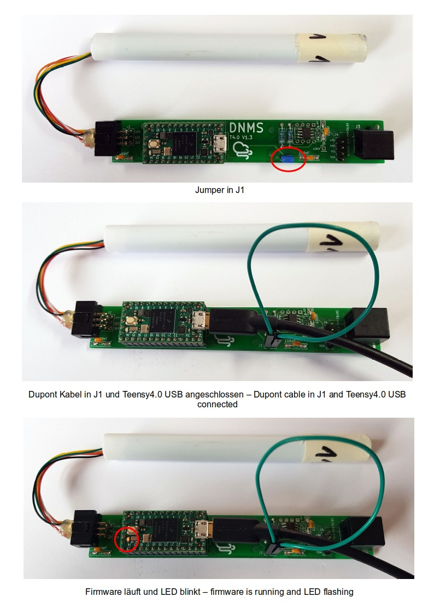
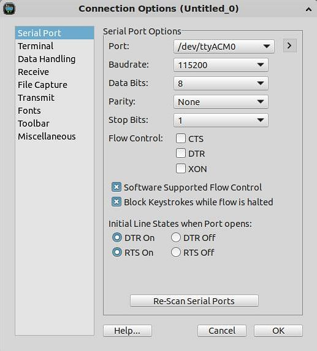
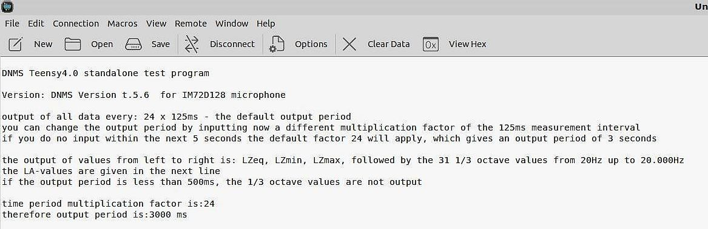
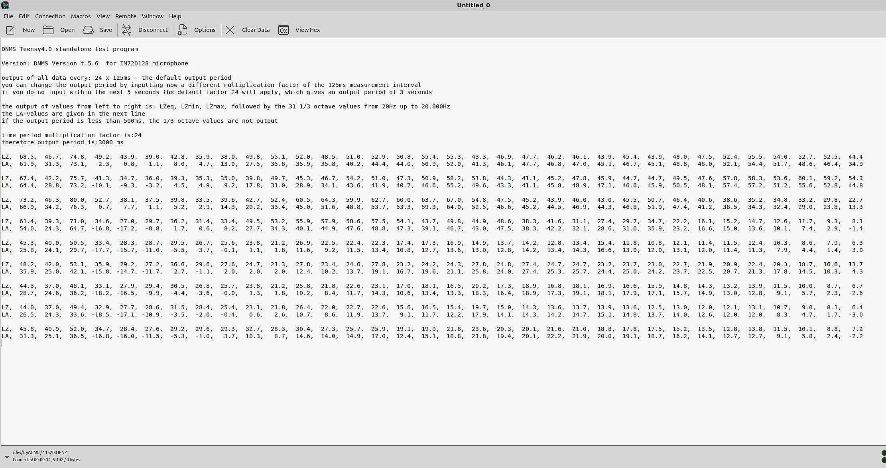
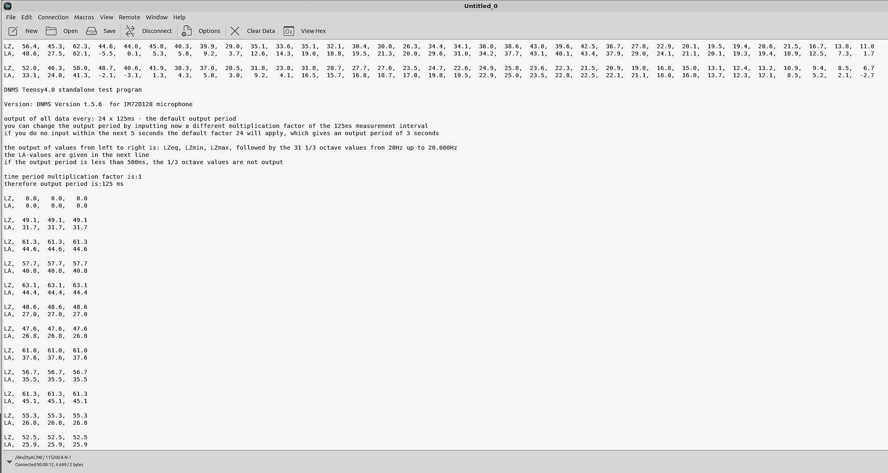

# [English text below](#standalone-test-program-for-microphone-and-teensy40)

# DNMS standalone Test Firmware Teensy 4.0

## Testprogramm für den autonomen Test von Mikrofon und Teensy4.0

Mit dieser Firmware kann ein einfacher Test von Mikrofon und Teensy4.0 ohne Anschluss an eine NodeMCU (oder einen anderen Kommunikationsprozessor) direkt mit einem PC/Laptop durchgeführt werden. Da die Firmware auf der gleichen Softwarebasis aufsetzt wie die Firmware Version 5 lassen sich damit auch Messungen mit Ausgabe der LA und LZ Werte an den PC mit einem festen Intervall (von 125ms bis 3600s) durchführen. Abhängig vom Mikrofon existieren zwei Versionen der Firmware:
- ICS-43434 Mikrofon - DNMS_Vt.5.4
- IM72D128 Mikrofon - DNMS_Vt.5.6

### Einsatz der Testprogramme

Die folgenden Schritte sind notwendig:

1. Aufspielen der Firmware DNMS_Vt.5.4 oder DNMS_Vt.5.6 auf dem Teensy4.0 Board

	Die entsprechende Firmware ist auf das Teensy4.0 Board in gleicher Weise aufzuspielen (flashen) wie die normalen Firmware Versionen:
 	- Brücke J1 mit einem Jumper oder einem Dupont-Kabel schließen, damit über das USB-Kabel vom PC her die Stromversorgung übernommen wird.

 	- PC mit dem Teens4.0 USB Anschluss verbinden und mit dem Teensy Loader die Firmware aufspielen (flashen) - siehe dazu den Punkt **Firmware auf das Teensy Board schreiben (flashen)** im README.md unter Firmware/Teensy
 	
	 

2. Terminalprogramm auf dem PC/Laptop installieren, wenn nicht vorhanden
	
	Um die Test-Ausgaben bzw. die Messwerte vom Teensy4.0 Board zu betrachten ist ein Terminalprogramm auf dem PC/Laptop notwendig wie z.B. Beispiel PuTTY, CoolTerm oder CuteCom (Linux und Mac OS X).
	Die Einstellungen für das Terminalprogramm sind (hier am Beispiel von CoolTerm unter Linux gezeigt): 
	
	 	

	Der Portname ist abhängig vom Betriebssystem. Bei Windows ist er über den Gerätemanager zu finden. Unter Linux ist der Name für dasTeensy4.0 Board normalerweise "/dev/tty/ACM0".   Sollen die Messwerte nicht nur angesehen sondern **auch aufgezeichnet **werden, so ist das bei einigen Terminalprogrammen möglich wie z.B. PuTTY, CoolTerm und CuteCom.
	
	
3. Test-Ausgaben bzw. Ausgabe der Messwerte

	Nach dem Start des Testprogramms werden zunächst die folgenden Informationszeilen ausgegeben:
	 	
	
	Das Messintervall kann innerhalb der ersten 5 Sekunden in Vielfachen von 125ms eingegeben werden. Erfolgt keine Eingabe innerhalb von 5 Sekunden wird als Messintervall der Default Wert von 3 Sekunden (= 24 * 125ms) genommen und die Ausgabe gestartet.
	Das niedrigste Messintervall von 125ms erhält man durch Eingabe einer 1 (= 1 * 125ms). Andere beliebige Messintervalle ergeben sich durch Eingabe einer positiven ganzen Zahl > 0 und der Multiplikation der eingegebenen Zahl mit 125ms.  
	Die Ausgabe der Messwerte eines Messintervalls erfolgt in zwei Zeilen als CSV Werte. In der ersten Zeile werden die LZ-Werte ausgegeben. Die Zeile beginnt mit der Markierung LZ,. Die zweite Zeile enthält die LA-Werte beginnend mit der Markierung LA,. Von links nach rechts werden ausgegeben LZeq, LZmin, LZmax, dann folgen die LZ-Terzwerte von 20Hz bis 20.000Hz (also 31 Werte). In der zweiten Zeile werden entsprechend die LA-Werte ausgegeben. Eine Leerzeile trennt die Werte der einzelnen Messintervalle.
	 	
	Bei Messintervallen < 500ms (= 4 * 125ms) werden **keine** Terzwerte ausgegeben, sondern nur die drei Werte LZeq, LZmin, LZmax und enstrechend in der zweiten Zeile LAeq, LAmin und LAmax wie das folgende Beispiel zeigt:
	
	 	

4. Änderung des Messintervalls

	Das Messintervalls kann bei laufender Ausgabe geändert werden durch Eingabe des '#' Zeichens. Es erfolgt ein Reset des Teensy4.0 Boards und das Testprogramm startet neu und ein anderer Wert für das Messintervall kann eingegeben werden. Achtung: Da ein Reset des Teensy4.0 erfolgt, wird die USB Verbindung unterbrochen. Einige Terminalprogramme brechen dann ab. Bei einigen Terminalprogrammen lässt sich ein 'Auto Reconnect" einstellen damit das Terminalprogramm nicht abbricht (z.B. CuteCom und CoolTerm, wie das obige Beispiel zeigt).

------------------------------------------------------------------------

## Standalone test program for microphone and Teensy4.0

This firmware allows easy testing of the microphone and Teensy4.0 board without connecting to a NodeMCU (or other communication processor) directly from a PC/laptop. This firmware uses the same software base as the version 5 Teensy firmware and therefore provides the same measurements of LZ and LA values directly to the connected PC/Laptop with fixed measurement intervals (from 125ms to 3600s).
Dependent on the used microphone two versions of the firmware exists:
- ICS-43434 Mikrofon - DNMS_Vt.5.4
- IM72D128 Mikrofon - DNMS_Vt.5.6

### How to use the test programs

Follow the steps below:

1. Flash firmware DNMS_Vt.5.4 or DNMS_Vt.5.6 on the Teensy4.0 board

	Flash the appropriate firmware version in the same way as the normal DNMS firmware for Teensy4.0:
 	- Close J1 with a jumper or a dupont cable to power the Teensy4.0 board via the USB connection from the PC/Laptop

 	- Connect the PC/laptop to the Teensy4.0 USB port and use the Teensy Loader to flash the firmware. 
 	Teensy Loader to flash the firmware - see **How to flash Teensy boards with the firmware** README.md under Firmware/Teensy
 	
	 

2. Install a terminal program on your PC/Laptop if none is installed
	
	To get the test outputs respectively the measurement values from the Teensy4.0 board, you need a terminal program on your PC/Laptop. Examples are PuTTY, CoolTerm or CuteCom (Linux and Mac OS X). The serial port options for the terminal program are shown below (example is CoolTerm on Linux):
	
	 	

	The port name depends on the operating system of your PC. If it's Windows, check the device manager. On Linux, the name is usually "/dev/tty/ACM0".  

	If you want to view **and save** the measurements, you can use a terminal program such as PuTTY, CoolTerm or CuteCom.

3. Test output respectively output of measurements 

	When the test program starts, the following lines are output:
	 	
	
	Within the first 5 seconds you can set the measurement interval to a multiple of 125ms. If no input is made within the first 5 seconds, the measurement interval will be set to the default value of 3 seconds (= 24 * 125ms) and the output will start.

	The lowest possible measurement interval of 125ms is obtained by entering a 1 (= 1 * 125ms). Other different measurements intervals are obtained by entering a positive integer > 0. This integer is multiplied by 125ms to give the measurement interval.  
	The readings are output in two lines as CSV values. The first line contains the LZ values. The line starts with the marker LZ,. The second line contains the LA values and starts with the marker LA,. From left to right the output is LZeq, LZmin, LZmax followed by 31 values for the 1/3 octaves from 20Hz to 20,000Hz. The second line shows the LA values. A blank line separates successive measurements.
	
	 	
	
	For measurement intervals < 500ms (= 4 * 125ms) **no **1/3 octave values are output. Only the three values LZeq, LZmin, LZmax and in the second line LAeq, LAmin and LAmax are output. This is shown in the following example:
	
	 	

4. Change of measurement interval

	It is possible to change the measurement interval while the test program is running by entering the character '#'. This will reset the Teensy4.0 board and restart the program. You can then enter another measurement interval. Attention: because of the reset of the Teensy4.0 board, the USB connection is closed and restarted, but some terminal programs may be shut down. There are terminal programs where you can configure an 'Auto Reconnect', e.g. CuteCom and CoolTerm, as the example above shows.

