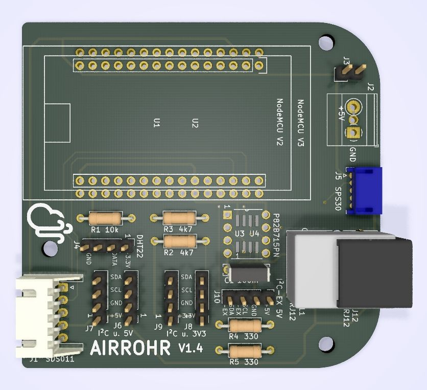
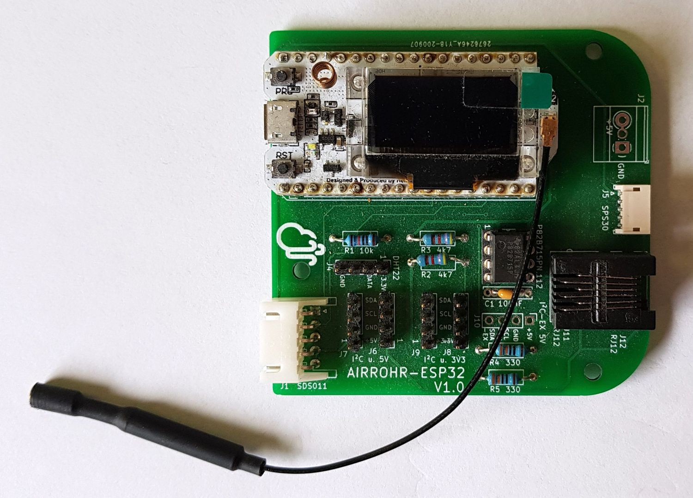
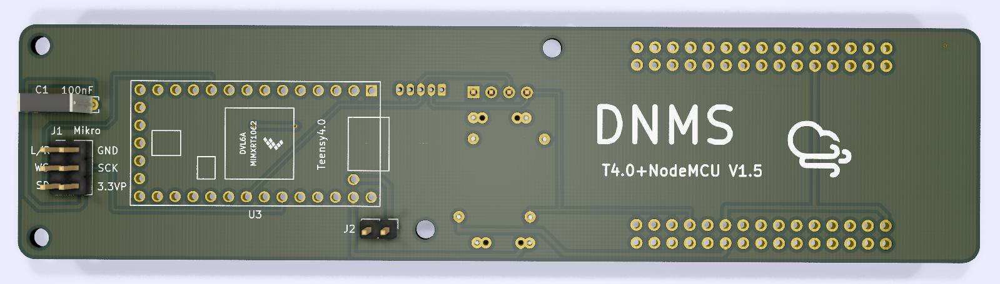

## English text below

## PCBs

## Funktion der verschiedenen PCBs

### ICS-43434 Mikrofon PCB
Ein rundes Mikrofon Board, das in ein 1/2" Plastikrohr (oder in 13mm Edelstahlrohr mit 12mm Innendurchmesser) eingebaut werden kann. Auf dem Board ist eine JST SH Buchse, auf die ein Kabel mit JST SH Stecker aufgesteckt werden kann. Entsprechende Kabel sind z.B. bei [Aliexpress hier erhältlich](https://de.aliexpress.com/item/33013143346.html?spm=a2g0s.9042311.0.0.b4924c4dbhEWkt).

PCB Versions Historie:
- ICS-43434-PCB-V1.3 - erste veröffentlichte Version

 

Wer nicht selbst bestücken und löten kann und will, kann das Board auch bei [PCBWAY](https://www.pcbway.com/) bestellen und bestücken lassen oder mal bei Franz Hoefle  <franz.hoefle (at) buergerforum-gladbeck.de>   fragen, ob er bestückte Boards hat.

### Airrohr PCB
Basis Board für eine NodeMCU V2 od. V3 mit Anschlüssen für die folgenden Sensoren:
- Feinstaubsensor SDS011 über Steckverbinder
- Feinstaubsensor SPS30 (Sensirion) über Steckverbinder
- DHT22 Temperatur- Feuchtigkeitssensor über Stiftleiste
- I²C Anschlüsse mit 3,3V und 5V Versorgungsspannungs für DNMS und andere Sensoren (z.B. BMP/E280 Temperatur- Feuchtigkeitssensor) über Stiftleiste
- I²C-Bus-Verlängerung mit 5V Versorgungsspannung für entfernten DNMS Sensor (bei Verbindungen > 250mm) über RJ12 Buchse bzw. Stiftleiste

PCB Versions Historie:
- Airrohr-V1.1 - erste Version
- Airrohr-V1.2 - I²C-Bus Verlängerung mit zusätzlicher RJ-12 (Modular Jack) 6P/6C Buchse
- Airrohr-V1.4 - RJ12 Buchse nun für zwei unterschiedliche "Footprints" und in der Ausrichtung geändert 
			   - einige Bauelemente nach innen verschoben, damit der Einbau in ein Gehäuse (Rohr) einfacher ist 
			   - P82B715 (I²C-bus Extender IC) kann im DIP8 Gehäuse oder im SO8 Gehäuse bestückt werden
- Airrohr-V1.5 - Masseflächen an Ober- und Unterseite
- Airrohr-V1.6 - Layoutänderung der Stromversorgung an den Bauteilen R1, R2, R3 und J4

 

### Airrohr ESP32 PCB
Basis Board wie Airrohr PCB aber für ESP32 CPU statt NodeMCU mit ESP8266 CPU. Das Board ist ausgelegt für das Heltec WiFi LoRa 32 (V2) Modul und das kompatible LILYGO TTGO LORA 32 V1  Modul. Beide ESP32 Module besitzen ein Display und auch LoRaWAN Funktionalität. Bitte mit Sensor.Community klären, inwieweit ESP32 Systeme und welche Funktionalität von der standard Sensor.Community Firmware unterstützt wird ohne die Firmware selbst zu compilieren oder zu erweitern. Ansonsten bietet das Board die gleichen Anschlussmöglichkeiten wie das Airrohr Board mit ESP8266 NodeMCU.

PCB Versions Historie:
- Airrohr-ESP32-PCB-V1.1 - erste Version

 

### DNMS-T3.6+NodeMCU
Kombiniertes Board für DNMS mit Teensy3.6 und NodeMCU V2 od. V3, neben der DNMS Funktion sind noch Anschlüsse für die die folgenden Sensoren vorhanden:
- Feinstaubsensor SPS30 (Sensirion) über Steckverbiner
- I²C Anschluss mit 3,3V Versorgungsspannung für z.B. BMP/E280 Temperatur- Feuchtigkeitssensor od. SHT3X Sensor über Stiftleiste

PCB Versions Historie:
- DNMS-T3.6+NodeMCU V1.0 - erste Version

### DNMS-T3.6
Basis Board für Teensy3.6 zum Anschluss ICS-43434 Mikrofon, die Lärmwerte werden über I²C an einen Kommunikationsprozessor (z.B. Airrohr-V1.4 mit NodeMCU) übertragen, für Entfernungen zum Kommunikationsprozessor > 250mm ist eine optionale I²C-Bus-Verlängerung vorhanden. Ein standard Telefonkabel mit RJ12 Verbindern (6P/6C) dient dann zur Verbindung des DNMS mit dem Airrohr Board.

PCB Versions Historie:
- DNMS-T3.6-V1.1 - erste Version
- DNMS-T3.6-V1.2 - I²C-Bus-Verlängerung mit zusätzlicher RJ-12 (Modular Jack) 6P/6C Buchse (passend zum Airrohr-V1.2)
- DNMS-T3.6-V1.3 - P82B715 (I²C-bus Extender IC) kann im DIP8 Gehäuse oder im SO8 Gehäuse bestückt werden
- DNMS-T3.6-V1.4 - RJ12 Buchse nun für zwei unterschiedliche "Footprints"

### DNMS-T4.0+NodeMCU
Kombiniertes Board für DNMS mit Teensy4.0 und NodeMCU V2 od. V3, neben der DNMS Funktion sind noch Anschlüsse für die die folgenden Sensoren vorhanden:
- Feinstaubsensor SPS30 (Sensirion) über Steckverbiner
- I²C Anschluss mit 3,3V Versorgungsspannung für z.B. BMP/E280 Temperatur- Feuchtigkeitssensor od. SHT3X Sensor über Stiftleiste

PCB Versions Historie:
- DNMS-T4.0+NodeMCU V1.2 - erste veröffentlichte Version
- DNMS-T4.0+NodeMCU V1.4 - einige Bauelemente wurden nach innen verschoben, damit der Einbau ins Gehäuse einfacher wird
- DNMS-T4.0+NodeMCU V1.5 - Masseflächen auf der Ober- und Unterseite um die Abschirmung zwischen Teensy4.0 und WLAN der NodeMCU zu erhöhen

 

### DNMS-T4.0
Basis Board für Teensy4.0 zum Anschluss ICS-43434 Mikrofon, die Lärmwerte werden über I²C an einen Kommunikationsprozessor (z.B. Airrohr-V1.4 mit NodeMCU) übertragen, für Entfernungen zum Kommunikationsprozessor > 250mm ist eine optionale I²C-Bus-Verlängerung vorhanden. Ein standard Telefonkabel mit RJ12 Verbindern (6P/6C) dient dann zur Verbindung des DNMS mit dem Airrohr Board.

PCB Versions Historie:
- DNMS-T4.0-V1.2 - erste Version
- DNMS-T4.0-V1.4 - P82B715 (I²C-bus Extender IC) kann im DIP8 Gehäuse oder im SO8 Gehäuse bestückt werden
				 - RJ12 Buchse für I²C-Bus-Verlängerung mit zwei unterschiedlichen "Footprints"
- DNMS-T4.0-V1.5 - Masseflächen an Ober- und Unterseite

 

----------------------------------------------------------------------------------------------------------------
## PCBs

## use of different PCBs

### ICS-43434 microphone PCB
A round microphone PCB, that fits into a 1/2" plastic tube (or into a 13mm stainless steel tube with 12mm inner diameter). A JST SH connector is on the board and a cable with JST SH connectors ca be used. Such cables are available e.g. at [Aliexpress](https://de.aliexpress.com/item/33013143346.html?spm=a2g0s.9042311.0.0.b4924c4dbhEWkt).

PCB revision history:
- ICS-43434-PCB-V1.3 - first version in GitHub

 

Who isn' t able or willing to do the board assembly and soldering can order e.g. at [PCBWAY](https://www.pcbway.com/) or may ask Franz Hoefle  <franz.hoefle (at) buergerforum-gladbeck.de>  if assembled boards are available.

### Airrohr PCB
Basis board for NodeMCU V2 or V3 with possible connection of the following sensors:
- PM sensor SDS011 via connector
- PM sensor SPS30 (Sensirion) via connector
- DHT22 temperatur and humidity sensor via pin header
- I²C connection with 3.3V and 5V power for DNMS and other sensors (i.e. BMP/E280 or SHT3x) via pin header
- I²C-bus-extension with 5V power for DNMS sensor with connection lenght > 250mm via RJ12 connector or pin header

PCB revision history:
- Airrohr-V1.1 - first version
- Airrohr-V1.2 - I²C-bus-extension with RJ12 connector (Modular Jack 6P/6C) or pin header
- Airrohr-V1.4 - support for two different footprints for RJ12 connector, placement of RJ12 connector to different side
			   - placement of some components more to the inner side, so that everything fits better in a case (i.e. tube)
			   - P82B715 (I²C-bus Extender IC) layout allows assembly of DIP8 or SO8 package
- Airrohr-V1.5 - ground-planes on top and bottom side
- Airrohr-V1.6 - change of layout for power connection of R1, R2, R3 and J4
			   
 

### Airrohr ESP32 PCB
Basis board as Airrohr PCB but for ESP32 CPU instead of ESP8266 NodeMCU. The board can hold the Heltec WiFi LoRa 32 (V2) modul or the compatible LILYGO TTGO LORA 32 V1 modul. Both have an display and as well LoRaWAN functionality. Please check with Sensor.Community if and what functionality is supported by the standard Sensor.Community firmware out of the box or if you have to compile the firmware yourself and doing your own additions. In other respects the boards gives the same possibilities of connections as the Airrohr PCB board based on ESP8266 NodeMCU.

PCB revision history:
- Airrohr-ESP32-PCB-V1.1 - first version

 

### DNMS-T3.6+NodeMCU
This is a combination of a NodeMCU and a Teensy3.6, besides the DNMS functionality the following sensors could be connected:
- SPS30 PM sensor via connector
- I²C connection with 3.3V power for sensors like BMP/E280 or SHT3x via pin header

PCB revision history:
- DNMS-T3.6+NodeMCU V1.0 - first version

### DNMS-T3.6
DNMS board for Teensy3.6 to connect a ICS-43434 microphone, the noise measurements are transmitted via the I²C-bus to a communication processor (i.e. Airrohr-V1.4 with NodeMCU), if the distance to the communication processor exceeds 250mm then the I²C-bus-extension with RJ12 connector (Modular Jack 6P/6C) can be used. A standard telephone cable with RJ12 jacks on both sides (6P/6C) with up to 5m length or more provides the connection of the DNMS and the Airrohr board.

PCB revision history:
- DNMS-T3.6-V1.1 - first version
- DNMS-T3.6-V1.2 - I²C-bus-extension with RJ12 connector (Modular Jack 6P/6C) (fits Airrohr-V1.2)
- DNMS-T3.6-V1.3 - P82B715 (I²C-bus Extender IC) layout allows assembly of DIP8 or SO8 package
- DNMS-T3.6-V1.4 - RJ12 connector now for two different footprints

### DNMS-T4.0+NodeMCU
This is a combination of a NodeMCU and a Teensy4.0, besides the DNMS functionality the following sensors could be connected:
- SPS30 PM sensor via connector
- I²C connection with 3.3V power for sensors like BMP/E280 or SHT3x via pin header

PCB revision history:
- DNMS-T4.0+NodeMCU V1.2 - first version
- DNMS-T4.0+NodeMCU V1.4 - some components were moved towards the inner side, so that everything fits better in a case (i.e. tube)
- DNMS-T4.0+NodeMCU V1.5 - ground-planes on both sides to improve shielding between Teensy4.0 and WLAN of NodeMCU

 

### DNMS-T4.0
DNMS board for Teensy4.0 to connect a ICS-43434 microphone, the noise measurements are transmitted via the I²C-bus to a communication processor (i.e. Airrohr-V1.4 with NodeMCU), if the distance to the communication processor exceeds 250mm then the I²C-bus-extension with RJ12 connector (Modular Jack 6P/6C) can be used. A standard telephone cable with RJ12 jacks on both sides (6P/6C) with up to 5m length or more provides the connection of the DNMS and the Airrohr board.

PCB revision history:
- DNMS-T4.0-V1.2 - first version
- DNMS-T4.0-V1.4 - P82B715 (I²C-bus Extender IC) layout allows assembly of DIP8 or SO8 package
				 - support for two different footprints for RJ12 connector
- DNMS-T4.0-V1.5 - ground-planes on top and bottom side

 
